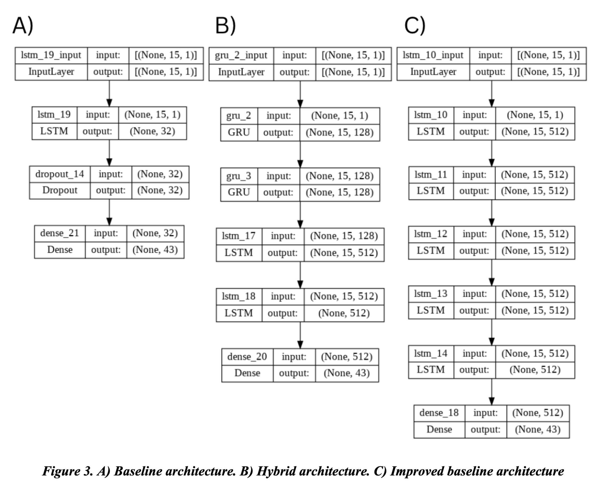
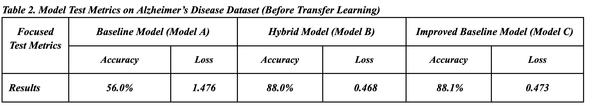
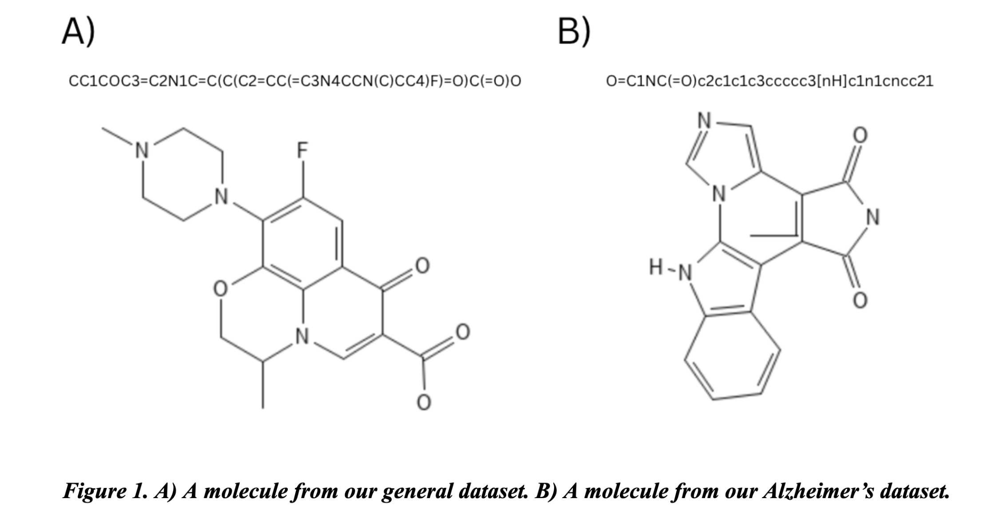

# A Generative Deep Learning Approach for Alzheimer’s Disease Drug Discovery

## Table of Contents
- [Introduction](#introduction)
- [Model Overview](#model-overview)
- [Data and Evaluation](#data-and-evaluation)
- [Project Structure](#project-structure)
- [Results](#results)

# Introduction
In the realm of drug discovery, especially for complex neurological conditions such as Alzheimer's disease, the journey from concept to viable treatment is notoriously prolonged, often extending beyond a decade. This slow pace is largely attributed to the overwhelming complexity of the chemical space, estimated at around 10^60 potential drug-like molecules. Traditional approaches often involve empirical selection from this vast space, a method that lacks efficiency and speed.

The advent of deep learning offers a transformative solution to this challenge. Leveraging its capacity to process and learn from large datasets, recent research advocates for the adoption of deep learning methodologies to hasten the drug discovery process. Notably, the integration of generative deep learning models, utilizing techniques akin to natural language processing (NLP), has shown promising potential in generating novel chemical structures. This innovative approach is poised to revolutionize how we identify and develop new compounds, particularly in the context of complex diseases.

Drawing inspiration from studies like those of Gupta et al. and Segler et al., which emphasize the effectiveness of LSTM RNNs in drug discovery and molecular generation, our project focuses on β-secretase 1 (BACE-1), a critical protein in Alzheimer’s disease progression. By integrating advanced LSTM and GRU neural networks, we aim to accelerate the generation of potential inhibitors for BACE-1, thereby contributing to the fight against Alzheimer's disease.

# Model Overview
I implemented three models from scratch:
- **Baseline Model (Model A)**: Consists of an LSTM layer and a dropout layer. It serves as a foundation for comparison and further model development.
- **Novel Model (Model B)**: A hybrid model combining GRU and LSTM layers to explore their efficacy in molecular generation.
- **Advanced Model (Model C)**: A complex LSTM-only model with enhanced depth.

    

# Data and Evaluation
In my project, I utilized a two-pronged approach involving a generic chemical dataset and a focused dataset for Alzheimer's disease and BACE-1, both sourced from ChEMBL. The generic dataset, comprising 300,000 compounds, enabled the models to learn broad chemical syntax. In contrast, the focused dataset, containing 1,560 BACE-1 inhibitors, allowed for learning complex features specific to Alzheimer's disease. The datasets were preprocessed using the Keras tokenizer and featured a modified n-grams sequence processing for character prediction.

# Project Structure
- **Baseline LSTM Code**: [Baseline Training Code](baseline_lstm.py)
- **Improved LSTM Model**: [Improved Training Code](improved_lstm.py)
- **Hybrid GRU/LSTM Model**: [Improved Training Code](hybrid_lstm.py)
- **Transfer Learning**: Leveraging Alzheimer's data for specific chemical structure generation. [Code](TL_hybrid.py)
- **Evaluation**: Scripts for model evaluation. [Evaluate General](evaluateModelGeneralDataset.py) | [Evaluate Transfer Learn](evaluateModelsSpecificDataset.py)
- **Molecule Generation**: Script for generating new molecules. [Molecule Generation](molecule_generator.py)

# Results
The models showed promising results in learning chemical structures and generating potential drug compounds:

- Baseline Model (Model A) showed an initial accuracy of 65.5%.
- Hybrid Model (Model B) achieved an accuracy of 88.0% after transfer learning.
- Advanced Model (Model C) showed the highest accuracy of 88.1%.

    

## Analysis and Adjustments
My initial analysis revealed a high bias in the baseline model, prompting the need for a larger network. This led to the development of Model C with its five LSTM layers, resulting in a remarkable training accuracy of 94.2% and testing accuracy of 88.1%, a substantial improvement from the baseline model's 56.0% testing accuracy.

## Molecule Generation
Using Model C, we successfully generated 18 new molecules, drawing from the Alzheimer’s dataset. Despite the molecules being slightly smaller than the reference due to the presence of a coded stop character, we demonstrated the model's capability to create valid chemical structures from molecular fragments.

     

# Conclusion
This work explored the viability of recurrent neural networks in drug generation for Alzheimer’s disease. I trained three models, a baseline model, a novel hybrid model, and an improved baseline model. My results significantly improved over my baseline model (Model A), which allowed me to be able to generate 18 new
molecules that can help inhibit BACE-1, slowing down Alzheimer's disease. In the end, I hope to continue working on these models past this project to see if I can improve our models and generate more molecules, so that I can help the many families struggling from this painful disease. Going forward, I could build off my project by exploring implementing a variational autoencoder (VAE) architecture that can add more variability to our generated results. Additionally, I can perform more rounds of error analysis on my improved baseline (Model C) and hybrid models (Model B) to try to increase our accuracy on the test data. Finally, I look forward to trying to validate that the molecules we generated are functional for Alzheimer's disease treatment, so that I can see how our work could get implemented to help people in real life.

## References

1. J. Cummings, P. S. Aisen, B. DuBois, L. Frölich, C. R. Jack, R. W. Jones, J. C. Morris, J. Raskin, S. A. Dowsett, and P. Scheltens, “Drug development in alzheimer’s disease: The path to 2025,” Alzheimer's Research & Therapy, vol. 8, no. 1, 2016.
2. J.-L. Reymond, “The Chemical Space Project,” Accounts of Chemical Research, vol. 48, no. 3, pp. 722–730, 2015.
3. A. Gupta, A. T. Müller, B. J. Huisman, J. A. Fuchs, P. Schneider, and G. Schneider, “Generative recurrent networks for de novo drug design,” Molecular Informatics, vol. 37, no. 1-2, p. 1700111, 2017.
4. M. H. Segler, T. Kogej, C. Tyrchan, and M. P. Waller, “Generating focused molecule libraries for drug discovery with recurrent neural networks,” ACS Central Science, vol. 4, no. 1, pp. 120–131, 2017.
5. A. Gaulton, L. J. Bellis, A. P. Bento, J. Chambers, M. Davies, A. Hersey, Y. Light, S. McGlinchey, D. Michalovich, B. Al-Lazikani, and J. P. Overington, “Chembl: A large-scale bioactivity database for Drug Discovery,” Nucleic Acids Research, vol. 40, no. D1, 2011.
6. S. Huang, H. Mei, L. Lu, M. Qiu, X. Liang, L. Xu, Z. Kuang, Y. Heng, and X. Pan, “De novo molecular design of caspase-6 inhibitors by a GRU-based recurrent neural network combined with a transfer learning approach,” Pharmaceuticals, vol. 14, no. 12, p. 1249, 2021.
7. T. T. Joy, S. Rana, S. Gupta, and S. Venkatesh, “Fast hyperparameter tuning using bayesian optimization with directional derivatives,” Knowledge-Based Systems, vol. 205, p. 106247, 2020.
8. S. Yang, X. Yu, and Y. Zhou, “LSTM and GRU neural network performance comparison study: Taking Yelp Review dataset as an example,” 2020 International Workshop on Electronic Communication and Artificial Intelligence (IWECAI), 2020.

